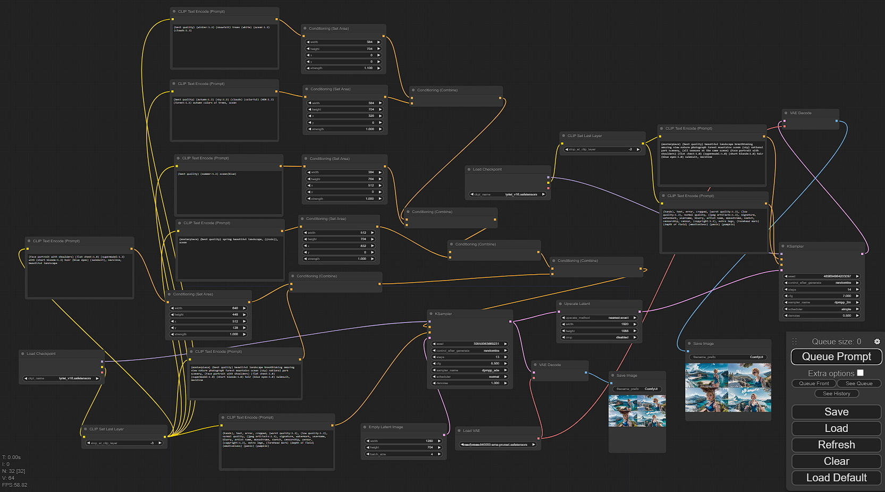
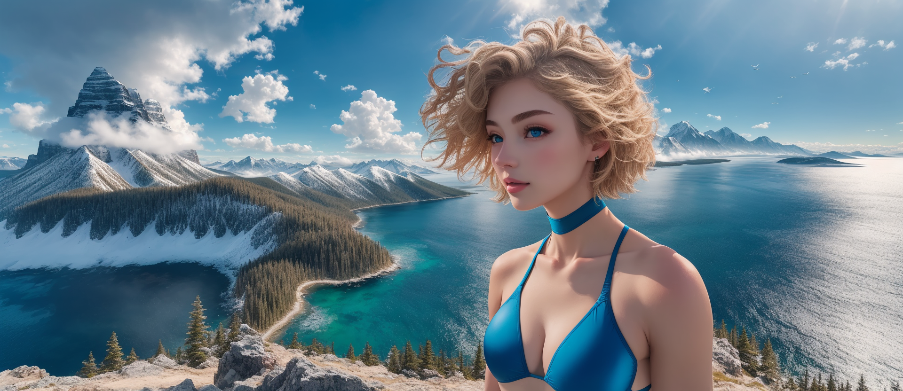

# ComfyUI_Example_Area_Composition

Example below is accompanied by a tutorial in my YouTube video: [https://youtu.be/c54HtMDZ_X4](https://youtu.be/c54HtMDZ_X4).

This ComfyUI node setup demonstrates how the Stable Diffusion conditioning mechanism functions. It stitches together an AI-generated horizontal panorama of a landscape depicting different seasons. The example is based on the original modular interface sample found in `ComfyUI_examples -> Area Composition Examples`: [https://comfyanonymous.github.io/ComfyUI_examples/area_composition/](https://comfyanonymous.github.io/ComfyUI_examples/area_composition/).

You can utilize it for your custom panoramas. Simply drag and drop the image into your ComfyUI interface window to load the nodes, modify some prompts, press "Queue Prompt," and wait for the AI generation to complete.

↑ An example of an AI-generated 1920 by 1088 image and its corresponding modular diagram.

[Pushing The Boundaries: Creating Stunning Panoramas with Stable Diffusion](https://youtu.be/c54HtMDZ_X4)

↑ Examples of AI-generated images in 1920 by 832 pixels and their corresponding modular diagram.
